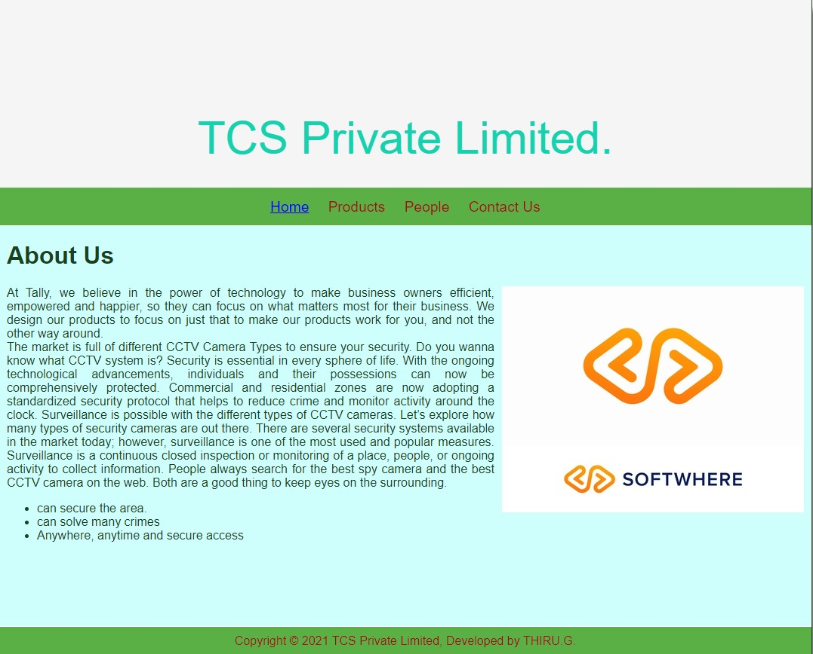
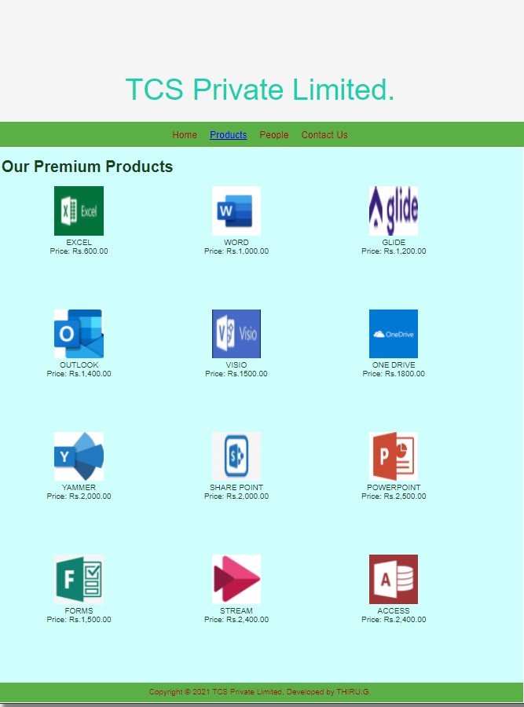
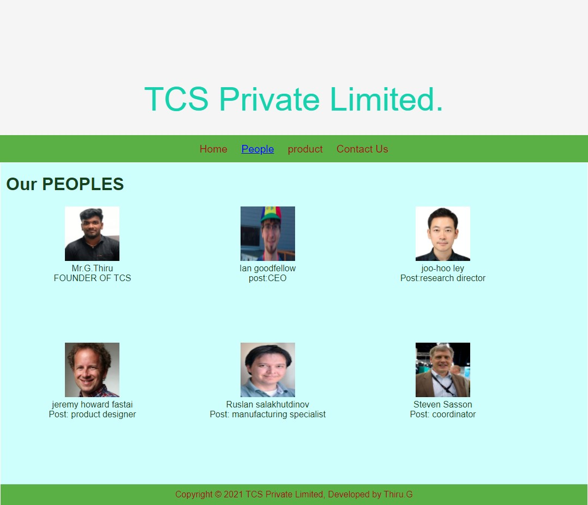
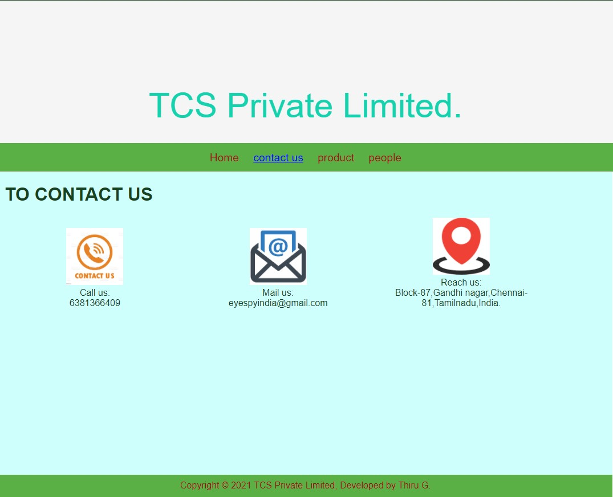

# Web Design for a Software Product Company

## AIM:

To design a static website for a software product company .

## DESIGN STEPS:

### Step 1:

Requirement collection.

### Step 2:

Creating the layout using HTML and CSS.

### Step 3:

Updating the sample content.

### Step 4:

Choose the appropriate style and color scheme.

### Step 5:

Validate the layout in various browsers.

### Step 6:

Validate the HTML code.

### Step 6:

Publish the website in the given URL.

## PROGRAM :
~~~
HOME CODE:
<!DOCTYPE html>
<html lang="en">
  <head>
    <title>TCS Private Limited</title>
    <link rel="stylesheet" href="./css/layout.css" />
    <link rel="icon" href="./img/CCTV.png" type="image/x-icon" />
  </head>

  <body>
    

      
TCS Private Limited.

      

        
<a href="/static/home.html">Home</a>

        
<a href="/static/products.html">Products</a>

        
<a href="/static/People.html">People</a>

        
<a>Contact Us</a>

      

      

        

          <h1>About Us</h1>
          
          

            At Tally, we believe in the power of technology to make business
            owners efficient, empowered and happier, so they can focus on what
            matters most for their business. We design our products to focus on
            just that to make our products work for you, and not the other way
            around.
             
            
            <ul>
              <li>can secure the area.</li>
              <li>can solve many crimes</li>
              <li>Anywhere, anytime and secure access</li>
            </ul>
          

        

      

      

        Copyright &#169; 2021 TCS Private Limited, Developed by THIRU.G.
      

    

  </body>
</html>

PRODUCT CODE:
<!DOCTYPE html>
<html lang="en">
  <head>
    <title>TCS Private Limited</title>
    <link rel="stylesheet" href="./css/layout.css" />
    <link rel="icon" href="./img/icon.png" type="image/x-icon" />
  </head>

  <body>
    

      
TCS Private Limited.

      

        
<a href="/static/home.html">Home</a>

        

          <a href="/static/products.html">Products</a>
        

        
<a>People</a>

        
<a>Contact Us</a>

      

      

        
    
          <h1>Our Premium Products</h1>
          

              
 
                  

                  
                  

                  
DOME CAMERA-purpose is Video Surveillance in Retail Stores and Offices with mic.

                  
Price: Rs.6,000.00 

              

              
 
                  

                  
                  

                  
BULLET CAMERA-purpose is Long-distance surveillance up to 40 FtOutdoors weatherproof surveillance

                  
Price: Rs.16,000.00 

              

             
              
 
                  

                  
                  

                  
C-MOUNT CAMERA-purpose is To achieve variable zoom in surveillance 

                  
Price: Rs.14,000.00 

              

            
              
 
                  

                  
                  

                  
DAY-NIGHT camera-pupose is For 24×7 surveillance Often in low light conditions

                  
Price: Rs.12,000.00 

              
 

              
 
                  

                  
                  

                  
PTZ camera -purpose is PTZ Cameras are to achieve responsiveness can rotate 360.degree, can zoom in and out. 

                  
Price: Rs.18,000.00 

              

               
 
                  

                  
                  

                  
HIGH DEFINITION camera-purpose is At highly niche places HD CCTV cameras work well e.g., casinos and banks Casino managers often check if a player is counting cards or not through this camera 

                  
Price: Rs.21,000.00 

              

              
              
 
                  

                  
                  

                  
INFRARED NIGHT VISION camera-pupose is it can see clearly when lighting is poor or absolute darkness.

                  
Price: Rs.18,000.00 

              
 

               
 
                  

                  
                  

                  
IP CAMERA works on wireless technology and pupose is to send recording over a far distance without requiring any power boost using a cable.

                  
Price: Rs.28,000.00 

              
 
               
              
 
                  

                  
                  

                  
SPY CCTV-its purpose is to spy an area without the knowledge of strangers.

                  
Price: Rs.12,500.00 

              

              
 
                  

                  
                  

                  
GATE INTERCOM-its purpose is to find and negiotiate with strangers by gate itself.

                  
Price: Rs.35,500.00 

              

            
               
 
                  

                  
                  

                  
WEB CAMERA-purpose is to make a video presentations through any online platforms.

                  
Price: Rs.2,400.00 

              

              
 
                  

                  
                  

                  
 RECOGNIZER camera-it works on advanced intelligence to recognize strangers through their eyes.

                  
Price: Rs.82,400.00 

              

          
        
      

      

        Copyright &#169; 2021 TCS Private Limited, Developed by THIRU.G.
      

    

  </body>
</html>

PEOPLE CODE:
<!DOCTYPE html>
<html lang="en">
  <head>
    <title>TCS Private Limited</title>
    <link rel="stylesheet" href="./css/layout.css" />
    <link rel="icon" href="./img/icon.png" type="image/x-icon" />
  </head>

  <body>
    

      
TCS Private Limited.

      

        
<a href="/static/home.html">Home</a>

        

          <a href="/static/people.html">People</a>
        

        
<a>product</a>

        
<a>Contact Us</a>

      

      

        
    
          <h1>Our PEOPLES</h1>
          

              
 
                  

                  
                  

                  
Mr.G.Thiru

                  
FOUNDER OF TCS

              

              
 
                  

                  
                  

                  
Ian goodfellow

                  
post:CEO

              

             
              
 
                  

                  
                  

                  
joo-hoo ley 

                  
Post:research director 

              

            
              
 
                  

                  
                  

                  
jeremy howard fastai

                  
Post: product designer

              
 

              
 
                  

                  
                  

                  
Ruslan salakhutdinov 

                  
Post: manufacturing specialist 

              

               
 
                  

                  
                  

                  
Steven Sasson

                  
Post: coordinator

              

              

          
        
      

      

        Copyright &#169; 2021 TCS Private Limited, Developed by Thiru.G
      

    

  </body>
</html>

CONTACT CODE:
<!DOCTYPE html>
<html lang="en">
  <head>
    <title>TCS Private Limited</title>
    <link rel="stylesheet" href="./css/layout.css" />
    <link rel="icon" href="./img/icon.png" type="image/x-icon" />
  </head>

  <body>
    

      
TCS Private Limited.

      

        
<a href="/static/home.html">Home</a>

        

          <a href="/static/contact us.html">contact us</a>
        

        
<a>product</a>

        
<a>people</a>

      

      

        
    
          <h1>TO CONTACT US</h1>
          

              
 
                  

                  
                  

                  
Call us: 

                  
6381366409

              

              
 
                  

                  
                  

                  
Mail us:

                  
eyespyindia@gmail.com

              

             
              
 
                  

                  
                  

                  
Reach us:

                  
Block-87,Gandhi nagar,Chennai-81,Tamilnadu,India.

              

             

         
        
      

      

        Copyright &#169; 2021 TCS Private Limited, Developed by Thiru.G.
      

    

  </body>
</html>

~~~

## OUTPUT:

## Result:

Thus a website is designed for the software product company and the HTML,CSS code are validated.
